<div align="center">

# ✦ Constellate

### Turn any text into a galaxy of ideas you can explore.

Drop in a textbook chapter, a research paper, lecture notes or a Wikipedia article. A neural network running **entirely in your browser** reads every idea, maps it by meaning, and lights it up as a star. Related ideas pull together into named topics, and how many depends on how rich the document is. Fly through them, **ask the sky questions in plain English**, then quiz yourself until every star burns gold.

**[✦ Launch the live demo](https://constellate.vercel.app)** · no sign-up · no API key · nothing leaves your device

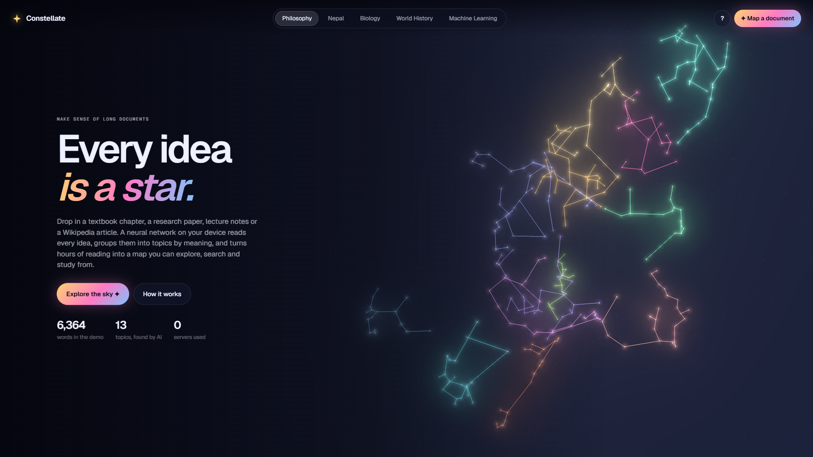


</div>

---

## Why

Notes are a flat list, but knowledge is a web. When you study, the hard part isn't reading each sentence. It's seeing **how the ideas connect**: which ones belong together, and which one leads to the next.

Constellate makes that structure visible. It turns a wall of text into a sky you can literally fly through, then helps you commit it to memory one star at a time.

## What it does

| | |
|---|---|
| 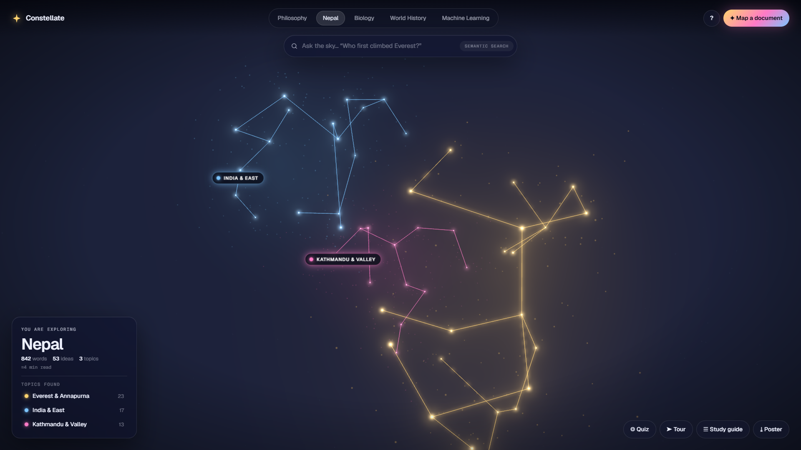 | **✦ Every idea is a star.** Related ideas cluster into constellations that are named automatically. Drag to orbit, scroll to zoom, and watch for shooting stars. |
| 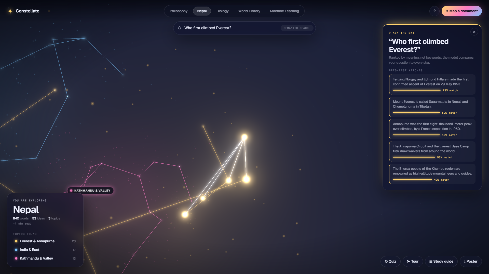 | **⌕ Ask the sky.** Type a question in plain English. The model embeds it and lights up the stars that answer it, ranked by meaning rather than keywords, with a match score for each. |
| 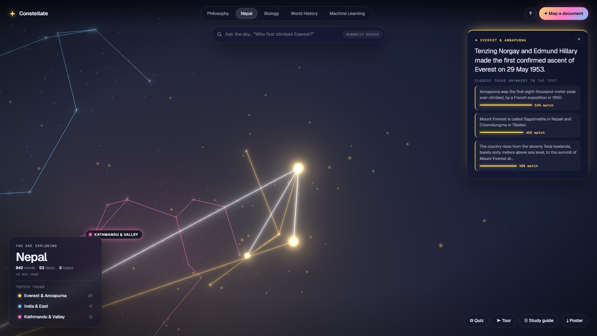 | **✧ Click any star** to fly to it. Glowing threads reach out to its three closest ideas *by meaning*, each with a similarity score. |
| 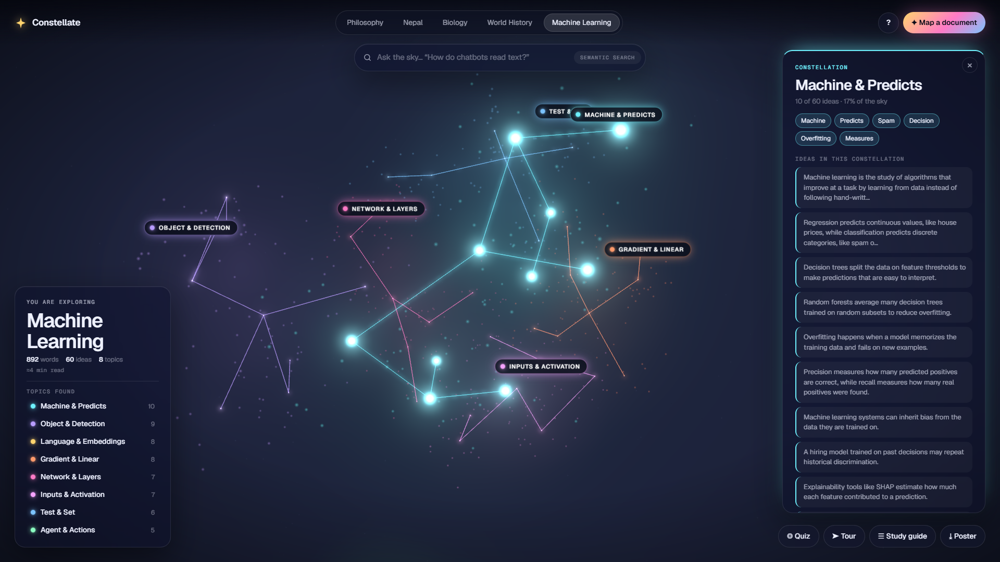 | **☄ Constellations.** Open one to see its keywords, how much of the sky it covers, and every idea inside it. |
| 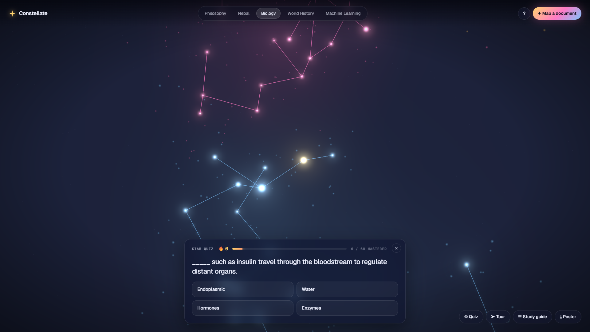 | **◎ Star Quiz.** The camera flies to a star and blanks out its key term. Wrong answers are drawn from the same constellation, so they're plausible. Answer right and the star turns gold. |
| 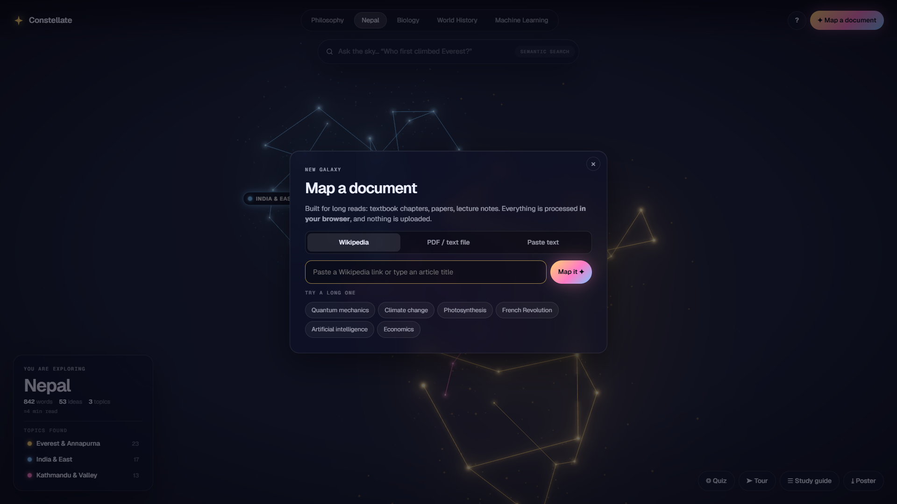 | **📄 Built for long documents.** Import a Wikipedia article by link, drop in a PDF / .txt / .md file, or paste text. The whole document is mapped: Wikipedia's *Quantum mechanics* (7,963 words) becomes 14 topics in about 30 seconds, and every star remembers which section it came from. |
| 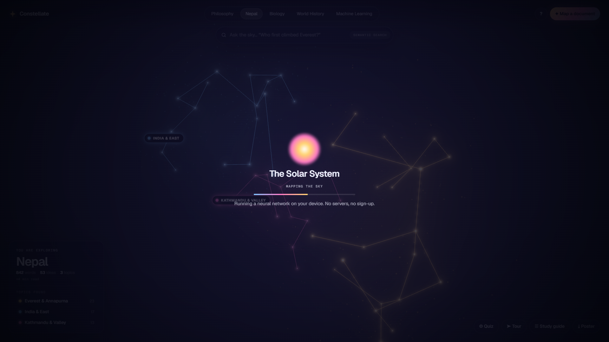 | **🧠 Your own text, on your device.** Paste anything. A 23 MB sentence-embedding model downloads once, runs in a Web Worker, and builds your galaxy in seconds. Your words never touch a server. |
| 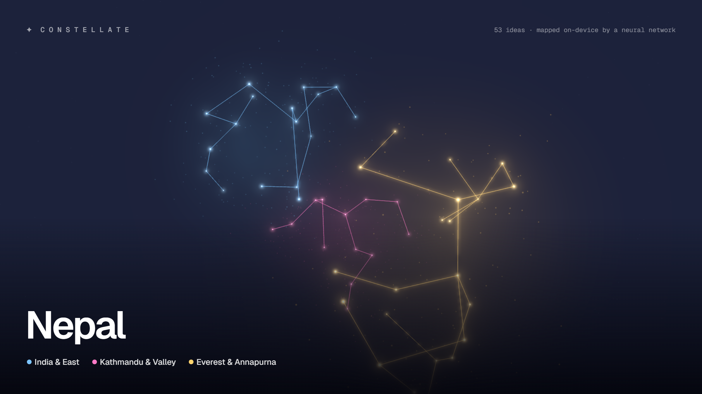 | **⤓ Poster export.** One click turns your galaxy into a share-ready 2400×1350 poster. |

| 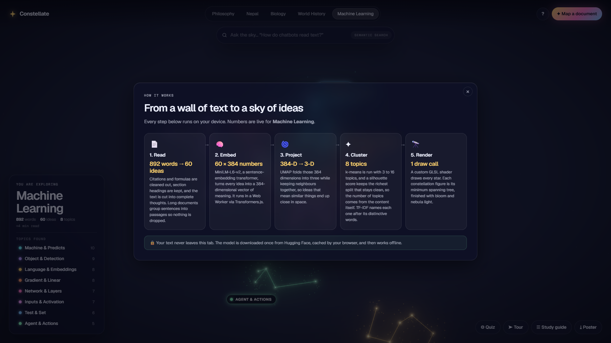 | **? How it works.** An in-app explainer walks through the pipeline using the live numbers of whichever galaxy you're viewing. |

Plus: **☰ Study guide** export (a Markdown outline: one chapter per topic, key terms, and every idea as a checklist), an auto-**Tour** that flies through every topic, five demo galaxies that load instantly (Wikipedia's **Philosophy** at 6,364 words, plus **Nepal**, **Biology**, **World History** and **Machine Learning**), and a layout that works on phones.

## How it works

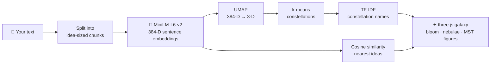

1. **Read.** Citations, URLs and LaTeX are cleaned out, section headings are kept, and the text is split into complete thoughts. Long documents group sentences into passages (up to 600 stars) so nothing is dropped.
2. **Embed.** [`all-MiniLM-L6-v2`](https://huggingface.co/Xenova/all-MiniLM-L6-v2) (quantized to 8-bit) turns each idea into a 384-dimensional vector that captures its *meaning*. It runs in the browser via [Transformers.js](https://github.com/huggingface/transformers.js), inside a Web Worker so the UI never freezes.
3. **Project.** [UMAP](https://github.com/PAIR-code/umap-js) squeezes 384 dimensions into 3 while keeping similar ideas close. That's why related sentences end up as neighbors in space.
4. **Cluster.** k-means (with k-means++ seeding) is run for 3 to 16 topics. The **silhouette score** picks the richest split that stays clean, so the number of topics comes from the content itself, not a fixed formula.
5. **Name.** Each constellation is named by TF-IDF, treating every cluster as one document. The top words are the ones that make *this* group different from the rest of the sky.
6. **Draw.** Each constellation's figure is its **minimum spanning tree**, the same trick that makes it read like a real star chart. The stars use a custom GLSL shader (twinkle, glow, a spiral "big bang" on load), with unreal bloom, additive nebula sprites and dust particles.

The demo galaxies are built by the **same pipeline** ahead of time (`npm run demos`), so the landing page renders instantly with zero model download.

See [`docs/architecture.md`](docs/architecture.md) for the full breakdown.

## Run it locally

Requires **Node 20+**.

```bash
git clone https://github.com/Prafyl/constellate.git
cd constellate
npm install
npm run dev
```

Open the URL Vite prints (usually http://localhost:5173).

| Command | What it does |
|---|---|
| `npm run dev` | Start the dev server with hot reload |
| `npm run build` | Build the static site into `dist/` |
| `npm run preview` | Serve the production build |
| `npm run demos` | Rebuild the demo galaxies from `demos/*.txt` (runs the ML pipeline in Node) |

Hosted on [Vercel](https://vercel.com): every push to `main` redeploys automatically.

## Project structure

```
constellate/
├── demos/                 # source texts for the demo galaxies
├── docs/                  # architecture notes + screenshots
├── public/
│   ├── demos/             # pre-computed galaxies (JSON)
│   └── samples/           # the "Try a sample" text
├── scripts/
│   ├── build-demos.ts     # runs the ML pipeline in Node
│   └── screenshots.ts     # captures docs/screenshots with headless Chrome
└── src/
    ├── galaxy/            # three.js: scene, star shader, nebulae, constellation lines, meteors
    ├── ml/                # chunking, embeddings worker + client, UMAP, k-means, TF-IDF
    ├── quiz/              # cloze question generator
    ├── ui/                # side panel, how-it-works, poster export
    ├── styles/            # the whole look
    └── main.ts            # app shell & interactions
```

## Built with & credits

- [three.js](https://threejs.org/): 3D rendering, `UnrealBloomPass`, `OrbitControls`, `CSS2DRenderer`
- [Transformers.js](https://github.com/huggingface/transformers.js) by Hugging Face: in-browser inference
- [`Xenova/all-MiniLM-L6-v2`](https://huggingface.co/Xenova/all-MiniLM-L6-v2): ONNX port of [sentence-transformers/all-MiniLM-L6-v2](https://huggingface.co/sentence-transformers/all-MiniLM-L6-v2) (Apache 2.0)
- [umap-js](https://github.com/PAIR-code/umap-js) by Google PAIR: dimensionality reduction
- [Vite](https://vitejs.dev/) + TypeScript: build tooling
- [PDF.js](https://mozilla.github.io/pdf.js/) by Mozilla: in-browser PDF text extraction
- Fonts: [Geist](https://fonts.google.com/specimen/Geist) and [Geist Mono](https://fonts.google.com/specimen/Geist+Mono) (Google Fonts, OFL)
- The Philosophy demo text comes from Wikipedia's [Philosophy](https://en.wikipedia.org/wiki/Philosophy) article (CC BY-SA 4.0).
- Demo texts were written for this project.
- Built with help from [Claude Code](https://claude.com/claude-code) (AI tools are allowed under the Hack Atlantic rules).

## License

[MIT](LICENSE)

<div align="center"><sub>Made in Nepal 🇳🇵 for Hack Atlantic 2026</sub></div>
