<div align="center">

# Constellate

### Turn any long reading into a galaxy of ideas, then study it.

Drop in a textbook chapter, a research paper, lecture notes or a Wikipedia article. A language model running **entirely in your browser** reads every idea and places it in 3D space by meaning. Related ideas pull together into named topics. Then you can explore it, ask it questions, explain it back in your own words and quiz yourself until every star turns gold.

**[Open the live app](https://constellate-black.vercel.app)** · no sign-up · no API key · nothing leaves your device

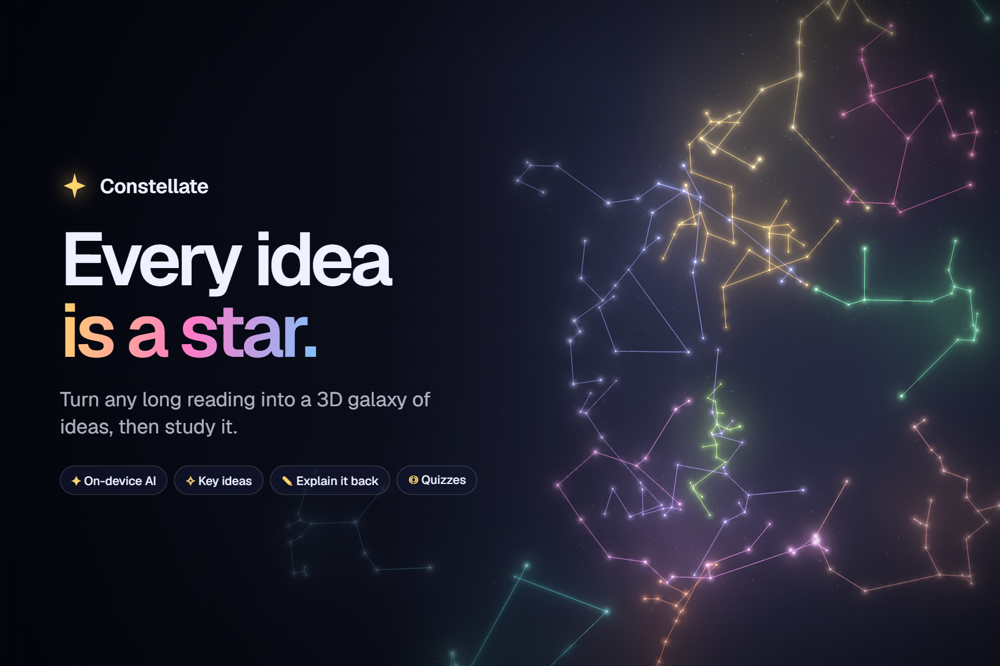


</div>

---

## Why

The night before an exam there's usually a 30 or 40 page chapter open and no real plan. Reading it isn't the hard part. The hard part is knowing what the main topics are, how they connect, and what's actually worth your time.

Notes are a long list, but the way ideas fit together is more like a web. Constellate shows you that web as a night sky, then gives you tools to study it one star at a time.

## What it does

<table>
<tr>
<td width="50%">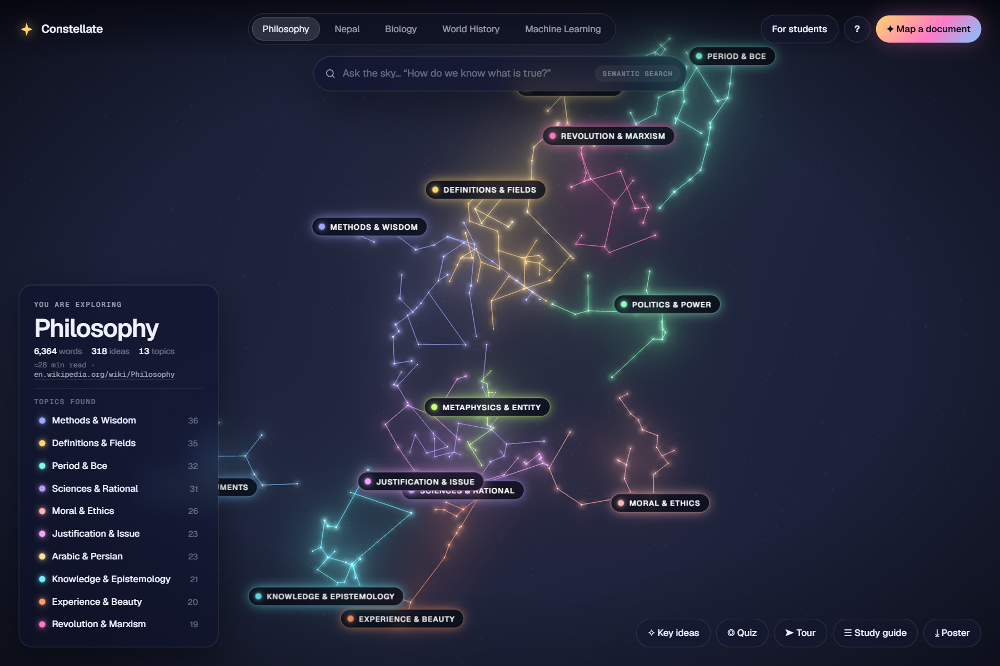</td>
<td><b>Every idea is a star.</b> Ideas that mean similar things form constellations, each named after what it's about. Wikipedia's <i>Philosophy</i> article (6,364 words) becomes 318 ideas in 13 topics. The number of topics comes from the text itself.</td>
</tr>
<tr>
<td>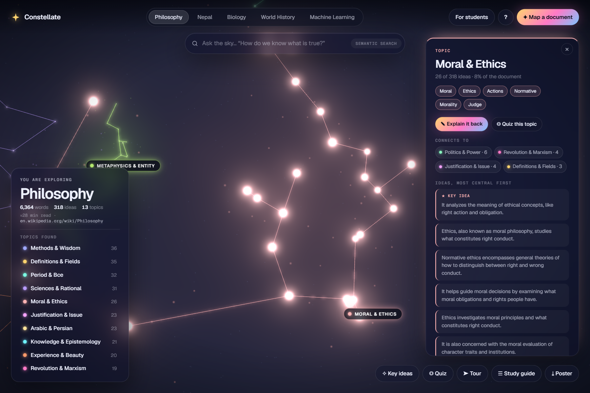</td>
<td><b>Topics.</b> Open one to see its key idea first, its key terms, every idea inside it, and which other topics it connects to.</td>
</tr>
<tr>
<td>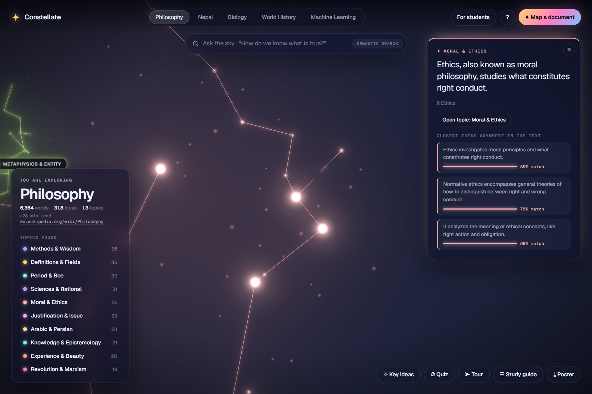</td>
<td><b>Stars.</b> Click one to read that idea and the section it came from. Threads link it to the three most similar ideas anywhere in the document.</td>
</tr>
<tr>
<td>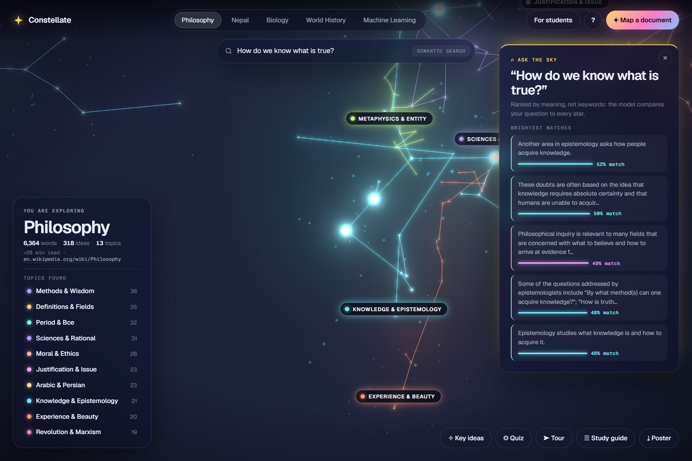</td>
<td><b>Ask the sky.</b> Ask a question in plain words and the best answers light up. It searches by meaning, so the answer doesn't need to share any words with your question.</td>
</tr>
<tr>
<td>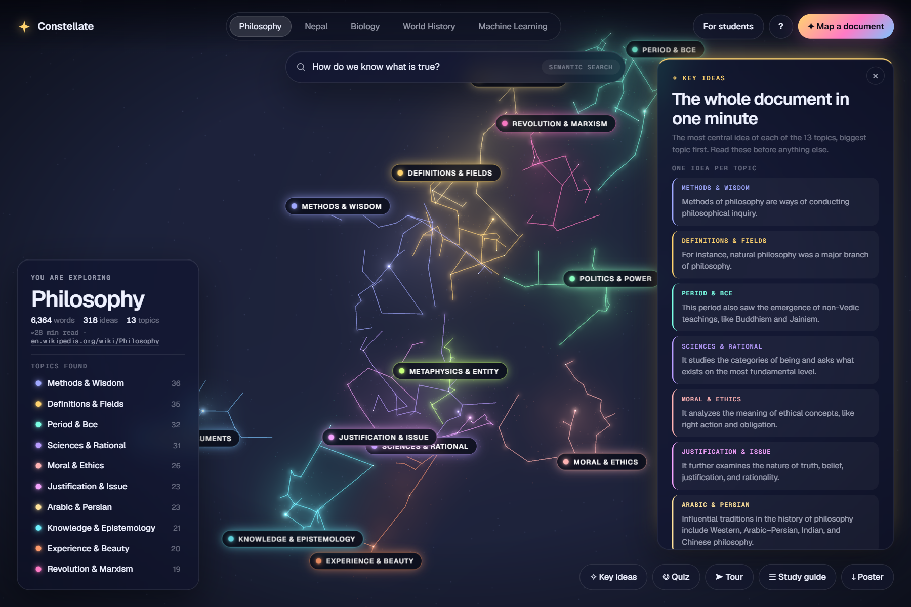</td>
<td><b>Key ideas.</b> The single most central idea of each topic. A one-minute summary of the whole document.</td>
</tr>
<tr>
<td>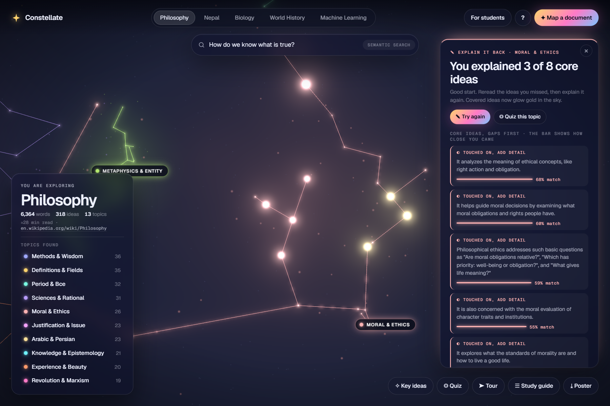</td>
<td><b>Explain it back.</b> Write what you remember about a topic. It shows which core ideas you explained, which you only touched on, and what to reread. Explained ideas turn gold.</td>
</tr>
<tr>
<td>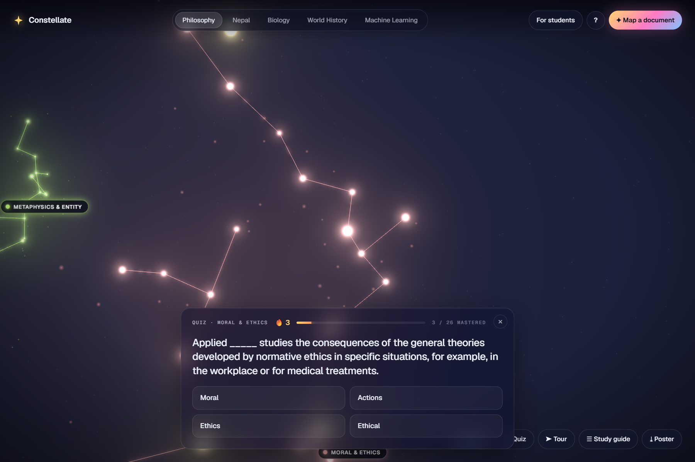</td>
<td><b>Quiz.</b> Fill-in-the-blank questions made from real sentences in the text, with wrong options from the same topic. Correct answers turn stars gold, and progress is saved on your device.</td>
</tr>
<tr>
<td>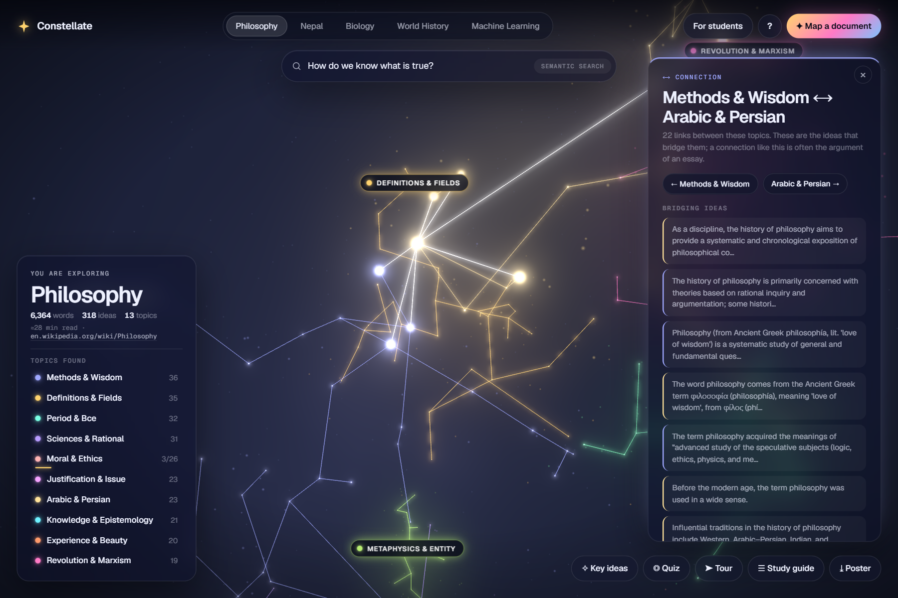</td>
<td><b>Connections.</b> See which topics link to each other and the ideas that bridge them. Handy when you're planning an essay.</td>
</tr>
<tr>
<td>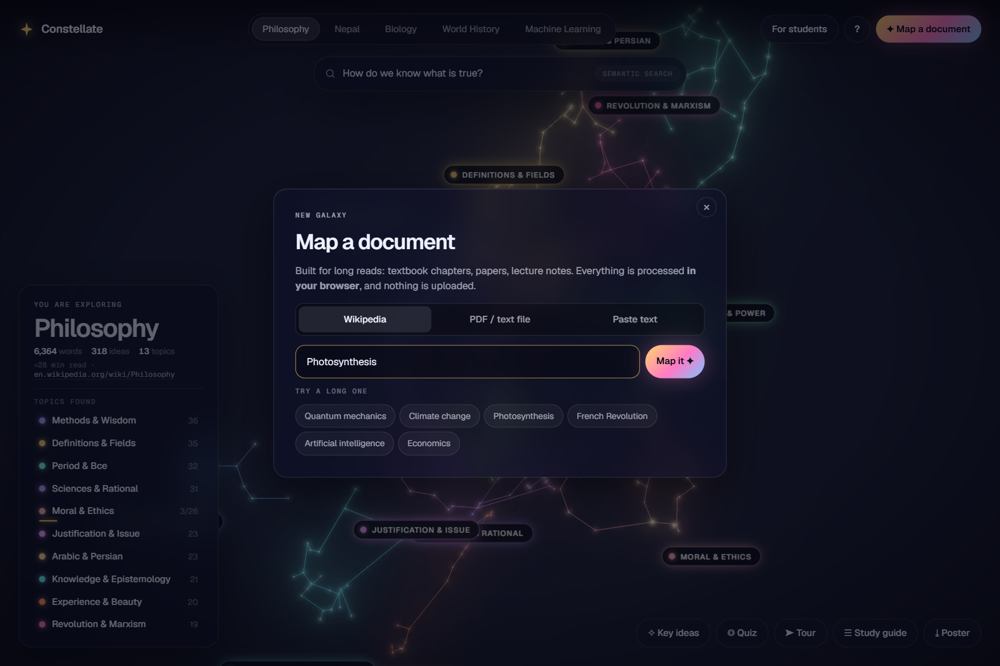</td>
<td><b>Map any document.</b> A Wikipedia link, a PDF, a .txt or .md file, or pasted notes. Long documents work best, up to about 600 ideas. <i>Quantum mechanics</i> (7,963 words) maps into 14 topics in about 30 seconds.</td>
</tr>
<tr>
<td>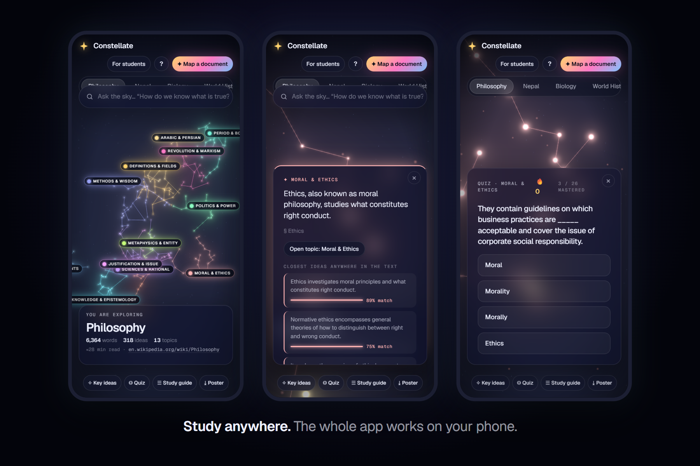</td>
<td><b>Works on phones.</b> The layout adapts to small screens, including the topic panels and the quiz.</td>
</tr>
</table>

Also included: a **study guide** download (Markdown, one chapter per topic with its key idea, key terms and a checklist of ideas), an automatic **tour** through every topic, a **poster** export, and an in-app **How it works** page that uses the live numbers of whatever galaxy you're viewing.

Five demo galaxies load instantly: **Philosophy**, **Nepal**, **Biology**, **World History** and **Machine Learning**.

## Built for students

Open **For students** in the top bar for real study situations (the night before an exam, reading a research paper, writing an essay, a term of lecture notes) with a *Try it* button on every feature. Or press **Watch the interactive demo** on the intro screen. It spotlights the real interface while the app runs each feature live and explains how to use it.

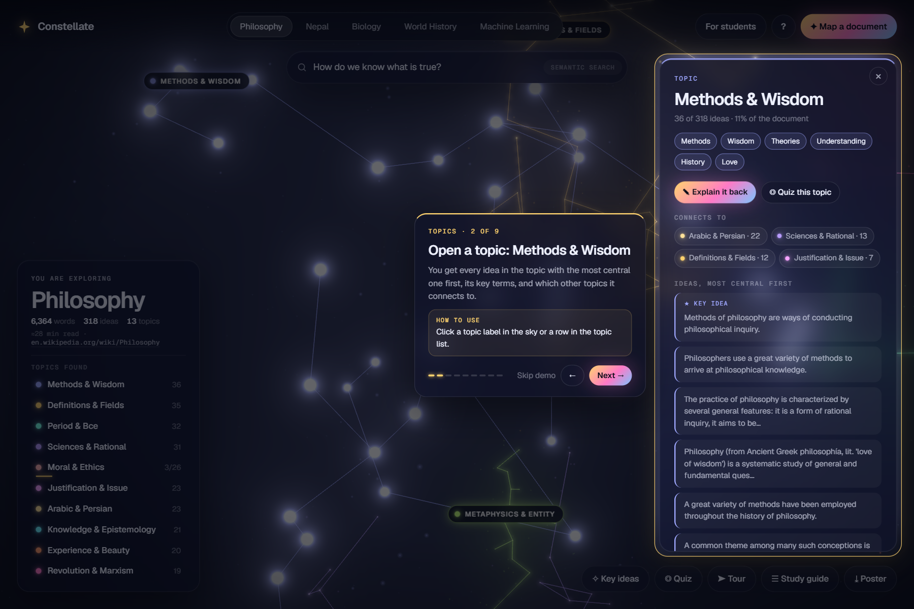

| Feature | What it does | How to use it |
|---|---|---|
| Key ideas | The most central idea of every topic | **Key ideas** in the bottom dock |
| Ask the sky | Search by meaning in your own words | Type in the top bar and press Enter |
| Explain it back | Checks your explanation against the topic's core ideas | Open a topic, then **Explain it back** |
| Quiz / Quiz this topic | Questions from the text; stars turn gold as you learn them | **Quiz** in the dock, or inside a topic |
| Connections | Linked topics and the ideas that bridge them | Open a topic, see **Connects to** |
| Study guide | Markdown checklist of every topic and idea | **Study guide** in the dock |
| Saved progress | Remembers what you've mastered on this device | Automatic |

## How it works

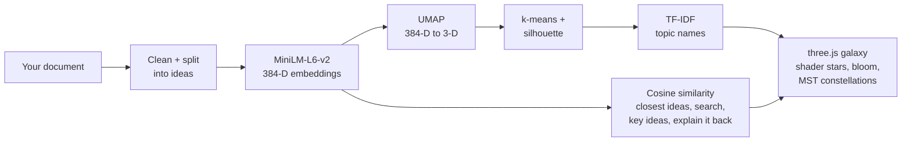

1. **Read.** Citation marks, URLs and Wikipedia's leftover LaTeX are removed, section headings are kept, and the text is split into ideas. Long documents group sentences into short passages so the whole thing fits (up to 600 stars).
2. **Embed.** [`all-MiniLM-L6-v2`](https://huggingface.co/Xenova/all-MiniLM-L6-v2) turns each idea into a 384-number vector that represents its meaning. It runs in the browser with [Transformers.js](https://github.com/huggingface/transformers.js) inside a Web Worker, on WebGPU when available and WebAssembly otherwise.
3. **Project.** [UMAP](https://github.com/PAIR-code/umap-js) reduces 384 dimensions to 3 while keeping similar ideas close together.
4. **Cluster.** k-means (k-means++ seeding) runs for 3 to 16 topics, and the **silhouette score** picks the most detailed split that's still clean. A short note gets 3 topics; a long article gets 13 to 15.
5. **Name.** TF-IDF treats each cluster as one document, so a topic's name comes from the words that make it different from the rest.
6. **Study.** A topic's key idea is the star closest to its centre in embedding space. *Explain it back* embeds each sentence you write and compares it with the topic's 8 most central ideas. Each sentence can count for at most two ideas, so one vague line can't claim a whole topic.
7. **Draw.** Each constellation's lines are its **minimum spanning tree**, which is why it looks like a star chart. All stars are drawn in one call with a custom GLSL shader, plus bloom, nebula sprites and dust.

The demo galaxies are built ahead of time with the **same pipeline in Node** (`npm run demos`), so the site opens instantly and the model is only downloaded when you map your own document. More detail in [`docs/architecture.md`](docs/architecture.md).

## Run it locally

Requires **Node 20+**.

```bash
git clone https://github.com/Prafyl/constellate.git
cd constellate
npm install
npm run dev
```

Then open the URL Vite prints (usually http://localhost:5173).

| Command | What it does |
|---|---|
| `npm run dev` | Start the dev server with hot reload |
| `npm run build` | Build the static site into `dist/` |
| `npm run preview` | Serve the production build |
| `npm run demos` | Rebuild the demo galaxies from `demos/*.txt` (runs the ML pipeline in Node) |
| `npm run gallery` | Capture the 15 gallery images into `docs/gallery/` |
| `npm run screenshots` | Capture the older screenshot set into `docs/screenshots/` |
| `npm run video` | Record the demo video into `video/constellate-demo.mp4` |

The last three drive the real app with headless Chrome (via `puppeteer-core`), so start the dev server on port 4317 first (`npm run dev -- --port 4317`). The video recorder moves a cursor through a scripted story, clicking real buttons and typing real questions, and encodes the frames with **ffmpeg** (which needs to be on your PATH). Set `CHROME` if Chrome isn't in the default Windows location.

Hosted on [Vercel](https://vercel.com). Every push to `main` redeploys automatically.

## Project structure

```
constellate/
├── demos/                   # source texts for the demo galaxies
├── docs/
│   ├── architecture.md      # pipeline notes
│   ├── gallery/             # 3:2 feature images
│   ├── screenshots/         # earlier screenshot set
│   └── thumbnail.png
├── public/
│   ├── demos/               # pre-computed galaxies (JSON)
│   └── samples/             # the "Try a sample" text
├── scripts/
│   ├── build-demos.ts       # runs the ML pipeline in Node
│   ├── gallery.ts           # captures docs/gallery
│   ├── record-video.ts      # scripted demo video
│   └── screenshots.ts       # captures docs/screenshots
└── src/
    ├── galaxy/              # three.js: scene, star shader, nebulae, constellation lines, meteors
    ├── io/                  # Wikipedia and PDF / text importers
    ├── ml/                  # chunking, embedding worker + client, UMAP, k-means, TF-IDF
    ├── quiz/                # fill-in-the-blank question generator
    ├── study/               # key ideas, explain it back, connections, saved progress
    ├── ui/                  # side panel, interactive demo, study guide, poster, how it works
    ├── styles/              # the whole look
    └── main.ts              # app shell and interactions
```

## Privacy

Your documents never leave your browser. The only network requests are loading the site and its fonts, downloading the model once from Hugging Face (about 23 MB, then cached), and fetching an article from the Wikipedia API if you choose to import one. Saved progress lives in your browser's local storage.

## Built with and credits

- [three.js](https://threejs.org/): 3D rendering, `UnrealBloomPass`, `OrbitControls`, `CSS2DRenderer`
- [Transformers.js](https://github.com/huggingface/transformers.js) by Hugging Face: in-browser inference
- [`Xenova/all-MiniLM-L6-v2`](https://huggingface.co/Xenova/all-MiniLM-L6-v2): ONNX port of [sentence-transformers/all-MiniLM-L6-v2](https://huggingface.co/sentence-transformers/all-MiniLM-L6-v2) (Apache 2.0)
- [umap-js](https://github.com/PAIR-code/umap-js) by Google PAIR: dimensionality reduction
- [PDF.js](https://mozilla.github.io/pdf.js/) by Mozilla: in-browser PDF text extraction
- [Vite](https://vitejs.dev/) and TypeScript: build tooling
- [Puppeteer](https://pptr.dev/) and [ffmpeg](https://ffmpeg.org/): gallery images and the demo video
- Fonts: [Geist](https://fonts.google.com/specimen/Geist) and [Geist Mono](https://fonts.google.com/specimen/Geist+Mono) (Google Fonts, OFL)
- The Philosophy demo text comes from Wikipedia's [Philosophy](https://en.wikipedia.org/wiki/Philosophy) article (CC BY-SA 4.0). Other demo texts were written for this project.
- Built with help from [Claude Code](https://claude.com/claude-code) (AI tools are allowed under the Hack Atlantic rules).

## License

[MIT](LICENSE)

<div align="center"><sub>Made in Nepal for Hack Atlantic 2026</sub></div>
