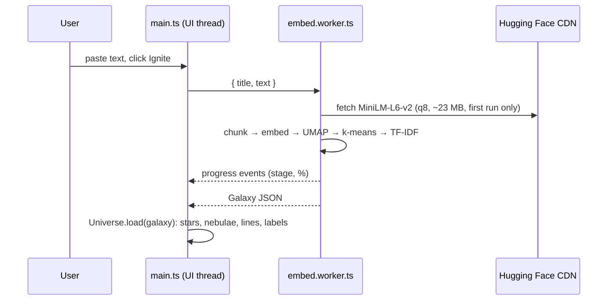

# Architecture

Constellate is a static site. There is no backend: all machine learning runs in the browser.



## The `Galaxy` format (`src/types.ts`)

```ts
interface Galaxy {
  title: string;
  stars: { id; text; pos: [x, y, z]; cluster; neighbors: number[]; term }[];
  constellations: { id; name; keywords; color; center; size }[];
}
```

The same object is produced by the Node build script (for the demo skies) and by the Web Worker (for pasted text), because both call `buildGalaxy()` in `src/ml/pipeline.ts` with a different `embed` function.

## ML pipeline (`src/ml/`)

| Step | Where | Notes |
|---|---|---|
| Chunk | `chunkText` | Sentence split, and fragments under 45 characters merge into the previous chunk. Capped at 260 stars. |
| Embed | `embed.worker.ts` | `all-MiniLM-L6-v2`, mean pooling, L2-normalized, batches of 16 |
| Project | `pipeline.ts` | UMAP to 3-D with a seeded PRNG (same text gives the same sky), then normalized to a sphere of radius 60 |
| Cluster | `kmeans` | *k* = √(n / 1.8), clamped to 3–9, run on the 3-D positions so constellations are spatially coherent |
| Name | `keywords.ts` | TF-IDF with clusters as documents; stems are de-duplicated, and names are unique across the sky |
| Neighbors | `pipeline.ts` | Top 3 by cosine similarity in the *original* 384-D space, so the "closest ideas" are closest in meaning |
| Quiz term | `bestTermIn` | The highest-scoring word of the star's own sentence |

## Rendering (`src/galaxy/`)

- **`stars.ts`**: one `THREE.Points` draw call. A custom shader handles the formation animation (spiral in from the core, staggered by radius), twinkle, and per-star state (normal, dim, lit, mastered, wrong) through a single float attribute.
- **`links.ts`**: constellation figures are the minimum spanning tree of each cluster (Prim's algorithm). Neighbor threads are drawn on selection.
- **`nebula.ts`**: additive sprites with a canvas radial gradient, plus a few hundred dust particles per constellation and a 5,000-star background.
- **`scene.ts`**: `EffectComposer` → `RenderPass` → `UnrealBloomPass` → `OutputPass`. Constellation labels are HTML via `CSS2DRenderer`, so they stay crisp and clickable. Camera flights use eased interpolation of the orbit target and position.
